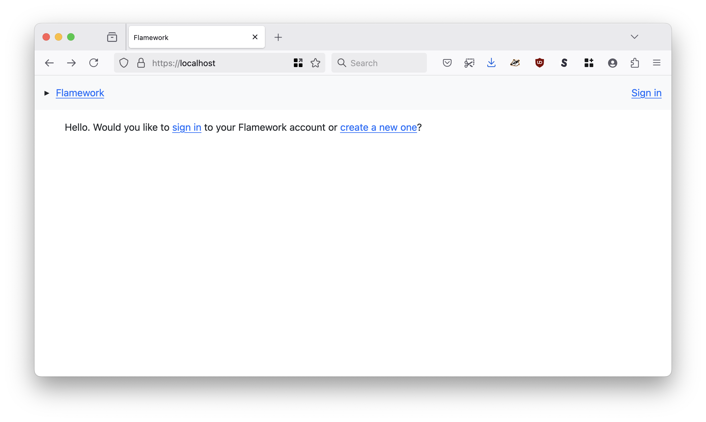

# flamework

A hard-fork for the `exflickr/flamework` project updated to work with PHP 8, Smarty 5 and ElasticSearch/OpenSearch in addition to MySQL.

## Motivation

This is a hard-fork for the `exflickr/flamework` project updated to work with PHP 8, Smarty 5 and ElasticSearch/OpenSearch in addition to MySQL. It also includes libraries and web pages for managing an OAuth2-based API and access tokens.

## Compatibility

This code has been updated to work with PHP 8.4 or higher and Smarty 5.5 or higher.

## Documentation

Documentation is incomplete. For the time have a look at the [docs](docs} folder.

* [Design Philosophy](docs/philosophy.md)
* [Database Model](docs/database_model.md)
* [Install (for `dnf` based systems)](docs/install.md)
* [Known Gotchas and Fixes for SELinux](docs/selinux.md)

## Deploying

Before deploying a Flamework application you will still need to perform the following tasks manually:

* Configuring MySQL database schemas and users. See [Database Model](docs/database_model.md) and [schema/*.schema](schema) for details.
* Creating a new `www/include/secrets.php` file with the MySQL database and other credentials. See [www/include/secrets.php.example](www/include/secrets.php.example) for details.

### Apache (httpd)

Historically, `flamework` applications have been deployed as part of a standard LAMP-stack running under the [Apache HTTP server](https://httpd.apache.org/). There is an example `VirtualHost` setup in [httpd/flamework.conf](httpd/flamework.conf).

### FrankenPHP

There is still-experimental work to run the `flamework` application provided by this repository under a [FrankenPHP server](https://frankenphp.dev/). "Experimental" as in: It works but there may still be bugs, or other gotchas, which haven't been accounted for yet. The PHP used by FrankenPHP is very strict about warnings and errors which is good because it will help track down things which need to be updated (in this package) but also not-so-good because it might lead to otherwise non-critical problems triggering errors and slowing down development time. 

Under the hood the `FrankenPHP` application is using the [Caddy webserver](https://caddyserver.com/) and there is an example `Caddyfile` configuration file in [frankenphp/Caddyfile](frankenphp/Caddyfile). 

The details of [installing FrankenPHP](https://github.com/dunglas/frankenphp?tab=readme-ov-file#getting-started) are outside the scope of this document but once you have you can test Flamework by running:

```
$> frankenphp run --config frankenphp/Caddyfile
```

And then when you open your web browser to `http://localhost` you should see something like this:



_In May 2025, the PHP Foundation announced that it would [officially support the FrankenPHP project](https://thephp.foundation/blog/2025/05/15/frankenphp/)._

## See also

* https://github.com/exflickr/flamework
* https://smarty-php.github.io/smarty/5.x
* https://www.php.net
